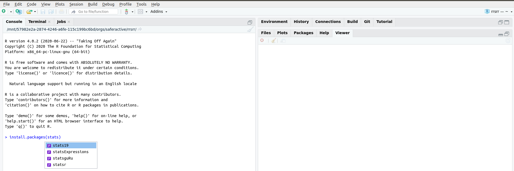
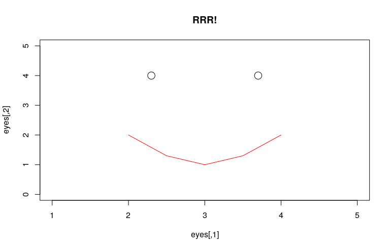

# R basics {#basics}

Learning a programming language is similar to learning a human language such as French.
Although you could just dive in and start gesticulating to people in central Paris, it's worth taking time to understand of the structure and key words of the language first.
The same applies to data science: it will help to understand a little about syntax and grammar of the R language before diving into using it for applications such as road safety research.
This chapter may seem tedious for people who just want to crack on and load-in data.
However, working through the examples below is recommended for most people unless you're already an experienced R user, and even experienced R users may learn something about the language's unique syntax in the following sections.

The first step is to **start RStudio**, e.g. by tapping the Start button and searching for RStudio if you are on Windows.
You should see an 'R console pane' like that displayed in Figure \@ref(fig:console).

```{r console, echo=FALSE, fig.cap='The R console pane in RStudio. You should see something like this when you first open RStudio. Having entered the text 'install.packages("stats', tapping 'Enter' at this point will trigger the autocompletion of the command `install.packages("stats19").'}

```

If you saw something like that shown in Figure \@ref(fig:console) congratulations!
You are ready to start running R code, by entering commands into the console.

## Creating and removing R objects

R can be understood as a giant calculator.
If you feed the console arithmetic tasks, it will solve them precisely and instantly.
Try typing the following examples (note that `pi` is an inbuilt object) into the R console in RStudio and pressing `Enter` to make R run the code.  The output of the code, when shown in this book, is preceeded by '##'.

```{r}
2 + 19
pi^(19 + 2) / exp(2 + 19) 
```

Use the same approach to find the square route of 361 (answer not shown):

```{r, eval=FALSE}
sqrt(361)
```

This is all well and good, providing a chance to see how R works with numbers and get practice with typing commands into the console.
However, a key benefit of R is that it is *object oriented*, meaning it stores values and complex objects such as data frames representing road casualties and processes them *in memory* (meaning that R is both fast and memory hungry when working with large datasets).

The two most common ways of creating objects are using `<-` 'arrow' or `=` 'equals'.  These are known as assignment operators as they assign contents(?), such as numbers, to objects.^[
We use equals assignment for speed of typing and to avoid ambiguity in commands such as `x<-1` vs `x< -1`, although `<-` has historically been (and still is) more commonly used in many fields.
]
Let's reproduce the calculations above using objects.  This makes the final command more concise:

```{r}
x = 2
y = 19
z = x + y
pi^z / exp(z)
```

The previous code chunk created and stored three objects called `x`, `y` and `z` and showed how these objects can themselves be used to create additional objects.
Why `x`, `y` and `z`?
Lack of imagination!
You can call R objects anything you like, provided they do not start with numbers or contain reserved symbols such as `+` and `-`.
You can use various stylistic conventions when naming your R objects, including `camelCase` and `dot.case`
[@baath_state_2012].
We advocate using `snake_case`, a style that avoids upper case characters to ease typing and uses the underscore symbol (`_`) to clearly demarcate spaces between words.

These objects have now served their purpose.

Based on wise saying that tidying up is the most important job, we will now remove these objects:

```{r}
rm(x, y, z)
```

What just happened?
We have removed the objects using the R function `rm()`, which stands for 'remove'. A function is an instruction or set of instructions for R to do something with what we give to that function.  What we give to the function are known as arguments.  Each function has set of arguments we can potentially give to it.  
Technically speaking, we *passed the objects to arguments in the `rm()` function call*.
In plain English, things that go inside the curved brackets that follow a function name are the arguments.
The `rm()` function removes the objects that it is passed (most functions modify objects).
A 'nuclear option' for cleaning your workspace is to run the following command, the meaning of which you will learn in the next section (can you guess?):

```{r}
rm(list = ls())
```

Next exercise: create objects that more closely approximate road casualty data by typing and running the following lines of code in the console:

```{r}
casualty_type = c("pedestrian", "cyclist", "cat")
casualty_age = seq(from = 20, to = 60, by = 20)
```

## Classes and object length

We now have two objects with sensible names 'in R'.
Specifically, the objects are attached to the global environment, which means they can be listed with the `ls()` command:

```{r}
ls()
```

It should be clear from this that the above command `rm(list = ls())` removes all objects in your global environment and should be **used with caution**.
This also makes the wider point that functions can accept arguments (in this case the `list` argument of the `rm()` function) that are themselves function calls.
Two key functions for getting the measure of R objects are `class()` and `length()`.

```{r}
class(casualty_type)
class(casualty_age)
```

The class of the `casualty_type` and `casualty_type` objects are `character` (meaning text) and `numeric` (meaning numbers), respectively.
Next challenge: guess their length and check your guess was correct by running the following commands (results not shown):

```{r, eval=FALSE}
length(casualty_type)
length(casualty_age)
```

The next function we will use is `data.frame()`

```{r}
crashes = data.frame(casualty_type, casualty_age)
```

Can you guess what that did?
Find out by entering the following line of code, which will print the contents of the object (results not shown - you need to run the command on your own computer to see the result):

```{r, eval=FALSE}
crashes
```

Without looking at its contents, we can get a handle of what is in the `chrashes` object as follows:

```{r}
class(crashes)
nrow(crashes)
ncol(crashes)
```

The results of the previous commands tell us that the dataset has 3 rows and 2 columns.
We will use larger datasets, with thousands of rows and tens of columns, in later chapters but for now it's good to 'start small' to understand the basics of R.

## Subsetting by index or column name

The most basic type of R object is a *vector*, a sequence of values of the same type. For example, a set of numbers. 
In the earlier examples, `x`, `y` and `z` were all *numeric vectors* with a length of 1; `casualty_type` is a *character vector* (because it contains letters that cannot be added) of length 3; and `casualty_age` is a *numeric vector* of length 3.
Subsetting returns part of an R object. 
Subsets of vectors can be returned by providing numbers representing the positions (index) of the elements within the vector we (e.g. '2' representing selection of the 2^nd^ element) or with logical (`TRUE` or `FALSE`) values associated with the elements that should be selected.

Two dimensional objects such as matrices and data frames can be subset by rows and columns.
Subsetting in base R is done with square brackets `[]` after the name of an object.
**Run the following commands to practice subsetting by index and column name and verify that you get the same results that are shown below.**

```{r, eval=FALSE}
casualty_age[2:3] # second and third casualty_age
crashes[c(1, 2), ] # first and second row of crashes
crashes[c(1, 2), 1] # first and second row of crashes, first column
crashes$casualty_type # returns just one column
```

The final command used the dollar symbol (`$`) to subset a column.
We can use the same symbol to create a new column as follows:

```{r}
vehicle_type = c("car", "bus", "tank")
crashes$vehicle_type = vehicle_type
ncol(crashes)
```

Notice that the dataset now has three columns after we added one to the right of the previous one.
Note also that this would involve copying and pasting cells in Excel, but in R it is instant and happens as fast as you can type the command.
To confirm what we think has happened has actually happened, let's print out the object again to see its contents:

```{r}
crashes
```

In Chapter \@ref(data) we will use `filter()` and `select()` functions to subset rows and columns.
Before we get there, it is worth practicing subsetting using the square brackets to consolidate your understanding of how base R works with vector objects such as `vehicle_type` and data frames such as `crashes`.
If you can answer the following questions, congratulations,  you are ready to move on.
If not, it's worth doing some extra reading and practice on the topic of subsetting in base R.


```{r, eval=FALSE, echo=FALSE}
crashes[, c(1, 3)] # first and third column of crashes by positional numbers
crashes[c(2), c(3)]
crashes[c(2), c(2, 3)]
class(crashes[, c(1, 3)])
class(crashes[c(2), c(3)])
```

<!-- ## Exercises {-} -->
<!-- Todo: should these be sections? -->
**Exercises**

1. Use the `$` operator to print the `vehicle_type` column of `crashes`.
1. Subset the crashes with the `[,]` syntax so that only the first and third columns of `crashes` are returned.
1. Return the 2^nd^ row and the 3^rd^ column of the `crashes` dataset. 
1. Return the 2^nd^ row and the columns 2:3 of the `crashes` dataset. 
1. **Bonus**: what is the `class()` of the objects created by each of the previous exercises? 

## Subsetting by values

It is also possible to subset objects by the values of their elements.
This works because the `[` operator accepts logical vectors returned by queries such as 'is it less than 3?' (`x < 3` in R) and 'was it light?' (`crashes$dark == FALSE`), as demonstrated below:

```{r, eval=FALSE}
x[c(TRUE, FALSE, TRUE, FALSE, TRUE)] # 1st, 3rd, and 5th element in x
x[x == 5] # only when x == 5 (notice the use of double equals)
x[x < 3] # less than 3
x[x < 3] = 0 # assign specific elements
casualty_age[casualty_age %% 6 == 0] # just the ages that are a multiple of 6
crashes[crashes$dark == FALSE, ]
```

1. Subset the `casualty_age` object using the inequality (`<`) so that only elements less than 50 are returned.
1. Subset the `crashes` data frame so that only tanks are returned using the `==` operator.
1. **Bonus**: assign the age of all tanks to 61.

```{r, eval=FALSE, echo=FALSE}
casualty_age[casualty_age < 50] # the  casualty_age less than 50
crashes[crashes$vehicle_type == "tank", ] # rows where the name is tank
crashes$casualty_age[crashes$vehicle_type == "tank"] = 61
```

## Dealing with NAs and recoding

R objects can have a value of NA. NA is how R represents missing data.

```{r, eval=FALSE}
z = c(4, 5, NA, 7)
```

NA values are common in real-world data but can cause trouble, for example

```{r, eval=FALSE}
sum(z) # result is NA
```

Some functions can be told to ignore NA values.

```{r, eval=FALSE}
sum(z, na.rm = TRUE) # result is equal to 4 + 5 + 7
```

You can find NAs using the `is.na()` function, and then remove them

```{r, eval=FALSE}
is.na(z)
z_no_na = z[!is.na(z)] # note the use of the not operator !
sum(z)
```

If you remove records with NAs be warned: the average of a value excluding NAs may not be representative.

## Changing class

Sometimes you may want to change the class of an object.
This is called class coercion, and can be done with functions such as `as.logical()`, `as.numeric()` and `as.matrix()`.

1. Coerce the `vehicle_type` column of `crashes` to the class `character`.
1. Coerce the `crashes` object into a matrix. What happened to the values?
1. **Bonus:** What is the difference between the output of `summary()` on `character` and `factor` variables?

```{r, echo=FALSE, eval=FALSE}
crashes$vehicle_type = as.character(crashes$vehicle_type)
as.matrix(crashes)
```

## Recoding values

Often it is useful to 'recode' values.
In the raw STATS19 files, for example, -1 means NA.
There are many ways to recode values in R, the simplest and most mature of which is the use of factors, which are whole numbers representing characters.  Factors are commonly used to manage categorical variables such as sex, ethnicity or, in road traffic research, vehicle type or casualty injury severity.   

```{r}
z = c(1, 2, -1, 1, 3)
l = c(NA, "a", "b", "c") # labels in ascending order
z_factor = factor(z, labels = l)
z_charcter = as.character(z_factor)
z_charcter
```

1. Recode `z` to Slight, Serious and Fatal for 1:3 respectively.
1. Bonus: read the help file at `?dplyr::case_when` and try to recode the values using this function.

## Saving R objects

You can also save individual R objects in the RDS format. The RDS format is the data format for R, meaning that any R object can be saved as an RDS file. This is equivalent to xls being the data format for Excel. 

```{r}
saveRDS(crashes, "crashes.Rds")
```

We can also read back in our data.

```{r}
crashes2 = readRDS("crashes.Rds")
identical(crashes, crashes2)
```

R also supports many other formats, including CSV files, which can be created and imported with the functions `readr::read_csv()` and `readr::write_csv()` (see also the [readr](https://readr.tidyverse.org/) package).

```{r readr-write, eval=FALSE}
readr::write_csv(crashes, "crashes.csv") # This code tells R to use the write_csv function from the readr package
crashes3 = readr::read_csv("crashes.csv")
identical(crashes3, crashes) 
```

Notice that `crashes3` and `crashes` are not identical, what has changed? Hint: read the help page associated with `?readr::write_csv`.

## Now you are ready to use RStudio

**Bonus: reproduce the following plot**

```{r smile, out.width="30%", fig.align="center"}
# eyes = c(2.3, 4, 3.7, 4)
# eyes = matrix(eyes, ncol = 2, byrow = T)
# mouth = c(2, 2, 2.5, 1.3, 3, 1, 3.5, 1.3, 4, 2)
# mouth = matrix(mouth, ncol = 2, byrow = T)
# # pdf("figures/smile.pdf")
# # png("figures/smile.png")
# plot(eyes, type = "p", main = "RRR!", cex = 2, xlim = c(1, 5), ylim = c(0, 5))
# lines(mouth, type = "l", col = "red")
# dev.off()

```
