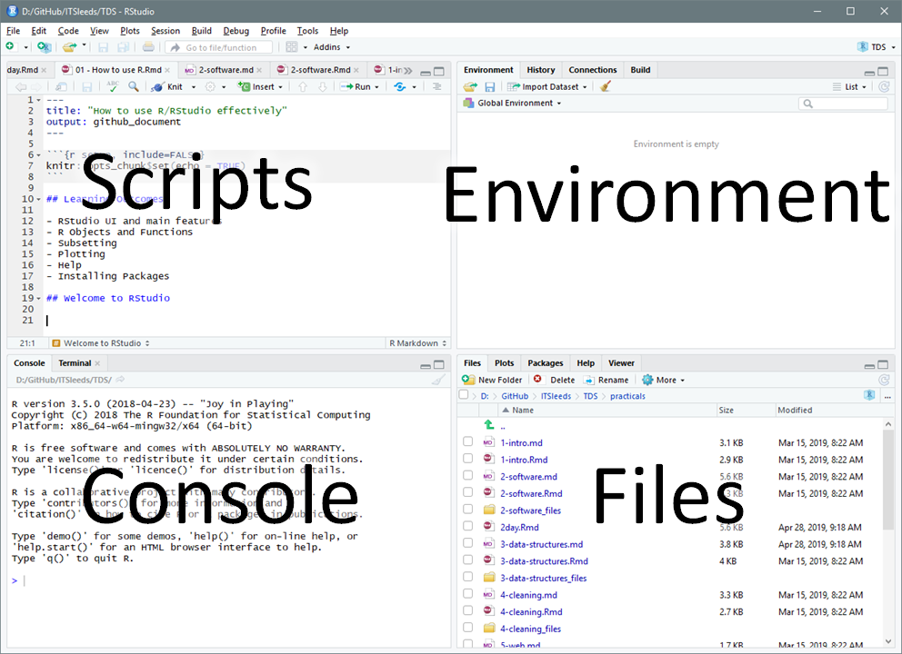
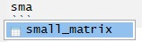
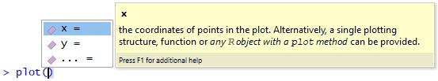
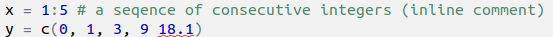

# Using RStudio

The previous chapter taught the basic's of the R language.
This chapter takes a step back and considers how R code fits into the wider context of scripts, projects, and getting help in RStudio.
RStudio is an integrated development environment (IDE) for R that makes it easy to create and run scripts, explore R objects and functions, plot results, and get help.

The first exercise is to open up RStudio and take a look around and identify the main components, shown in the figure below.
**Explore each of the main components of RStudio.**
Try changing the Global Settings (in the Tools menu) and see RStudio's short cuts by pressing `Alt-Shift-K` (or `Option+Shift+K` on Mac).

```{r rstudioui, echo=FALSE, out.width="70%"}
# download.file("https://raw.githubusercontent.com/ITSLeeds/TDS/master/courses/2day/images/rstudio-ui.png", "figures/rstudio-ui.png")

```

## Projects and scripts

Projects are a way to organise related work together. Each project has its own folder and Rproj file. **Advice: always working from projects will make your life easier!** Start a new project with:

> File > New Project
You can choose to create a new directory (folder) or associate a project with an existing directory. Make a new project called stats1-course and save it in a sensible place on your computer. Notice that stats1-course now appears in the top right of RStudio.

Scripts are the files where R code is stored.
**Keeping your code in sensibly named, well organised and reproducible scripts will make your life easier:**
you could simply type all our code into the console, but that require retyping commands each time you run it.
Instead, code that you want to keep and share should be saved script files, plain text files that have the `.R` extension.

Make a new script with Flie > New File > Rscript or Ctrl+Shift+N

Save the script and give it a sensible name like `stats19-lesson-1.R` with File > Save, the save button on the toolbar, or Ctrl+S.

**Pro tip:** You can also create new R scripts by typing and running this command in the R console:

```{r edit, eval=FALSE}
file.edit("stats19-lesson-1.R")
```

Keeping scripts and other files associated with a project in a single folder per project (in an RStudio project) will help you find things you need and develop an efficient workflow.

## Writing and running code

Let's start with some basic R operations.
Write this code into your new `stats19-lesson-1.R` R script and execute the result line-by-line by pressing Ctrl+Enter

```{r, eval=FALSE}
x = 1:5
y = c(0, 1, 3, 9, 18)
plot(x, y)
```

This code creates two objects, both are vectors of 5 elements, and then plots them (bonus: check their length using the `length()` function).
Save the script by pressing Ctrl+S.

There are several ways to run code within a script and it is worth becoming familiar with each.
Try running the code you saved in the previous section using each of these methods:

1. Place the cursor in different places on each line of code and press `Ctrl+Enter` to run that line of code.
1. Highlight a block of code or part of a line of code and press `Ctrl+Enter` to run the highlighted code.
1. Press `Ctrl+Shift+Enter` to run all the code in a script.
1. Press the Run button on the toolbar to run all the code in a script.
1. Use the function `source()` to run all the code in a script e.g. `source("stats19-lesson-1.R")`
<!-- (but don't create an infinite loop!) -->

**Pro tip:** Try jumping between the console and the source editor by pressing Ctl+1 and Ctl+2.

## Viewing Objects

Create new objects by typing and running the following code chunk in a new script, e.g. called `objects.R`.

```{r}
vehicle_type = c("car", "bus", "tank")
casualty_type = c("pedestrian", "cyclist", "cat")
casualty_age = seq(from = 20, to = 60, by = 20)
set.seed(1)
dark = sample(x = c(TRUE, FALSE), size = 3, replace = TRUE)
small_matrix = matrix(1:24, nrow = 12)
crashes = data.frame(vehicle_type, casualty_type, casualty_age, dark)
```

We can view the objects in a range of ways:

1. Type the name of the object into the console, e.g. `crashes` and `small_matrix`, and run that code. Scroll up to see the numbers that didn't fit on the screen.
1. Use the `head()` function to view just the first 6 rows e.g. `head(small_matrix)`
1. Bonus: use the `n` argument in the previous function call to show only the first 2 rows of `small_matrix`
1. Click on the `crashes` object in the environment tab to View it in a spreadsheet.
1. Run the command `View(vehicle_type)`. What just happened?

We can also get an overview of an object using a range of functions, including 
`summary()`,
`class()`,
`typeof()`,
`dim()`, and
`length()`.

You can, for example, view a summary of the `casualty_age` variable by running the following line of code:

```{r summary}
summary(casualty_age)
```

**Exercise** try these functions on each of the objects, what results do they give?

```{r summary-answers, echo=FALSE, eval=FALSE}
summary(vehicle_type)
class(vehicle_type)
typeof(vehicle_type)
dim(vehicle_type)
length(vehicle_type)
```

**Bonus**: Find out the class of the column `vehicle_type` in the data frame `crashes` with the command `class(crashes$vehicle_type)`.
Why has it changed? 
Create a new object called `crashes_char` that keeps the class of the character vectors intact by using the function `tibble::tibble()` (see [tibble.tidyverse.org](https://tibble.tidyverse.org/) and Section 4 for details).

```{r tibble1, echo=FALSE, eval=FALSE}
tibble::tibble(
  vehicle_type,
  casualty_type,
  casualty_age,
  dark
)
```

## Autocompletion

RStudio can help you write code by autocompleting it. RStudio will look for similar objects and functions after typing the first three letters of a name.

```{r autocomp, echo=FALSE}
# knitr::include_graphics("https://raw.githubusercontent.com/ITSLeeds/TDS/master/courses/2day/images/autocomplete.jpg")
# download.file("https://raw.githubusercontent.com/ITSLeeds/TDS/master/courses/2day/images/autocomplete.jpg", "figures/autocomplete.jpg")

```

When there is more than one option you can select from the list using the mouse or arrow keys.
Within a function, you can get a list of arguments by pressing Tab.

```{r help, echo=FALSE}
# knitr::include_graphics("https://raw.githubusercontent.com/ITSLeeds/TDS/master/courses/2day/images/fucntionhelp.jpg")
# download.file("https://raw.githubusercontent.com/ITSLeeds/TDS/master/courses/2day/images/fucntionhelp.jpg", "figures/functionhelp.jpg")

```

## Getting help

Every function in R has a help page. You can view the help using `?` for example `?sum`. Many packages also contain vignettes, these are long form help documents containing examples and guides. `vignette()` will show a list of all the vignettes available, or you can show a specific vignette for example `vignette(topic = "sf1", package = "sf")`.

## Commenting Code

It is good practice to use comments in your code to explain what it does. You can comment code using `#`

For example:

```{r}
# Create vector objects (a whole line comment)
x = 1:5 # a seqence of consecutive integers (inline comment)
y = c(0, 1, 3, 9, 18.1) 
```

You can comment/uncomment a whole block of text by selecting it and using `Ctrl+Shift+C`.
<!-- not sure about the next statement so commenting out (RL) -->
<!-- and you can reformat a block of code using `Ctrl+Shift  + /`.  -->

**Pro tip:** You can add a comment section using Ctrl + Shift + R


## The global environment

The Environment tab shows all the objects in your environment, this includes datasets, parameters, and any functions you have created.
By default, new objects appear in the Global Environment but you can see other environments with the drop-down menu.
For example, each package has its own environment.

Sometimes you wish to remove things from your environment, perhaps because you no longer need them or things are getting cluttered.

You can remove an object with the `rm()` function e.g. `rm(x)` or `rm(x, y)` or you can clear your whole environment with the broom button on the Environment Tab.

1. Remove the object `x` that was created in a previous section.
1. What happens when you try to print the `x` by entering it into the console?
1. Try running the following commands in order: `save.image(); rm(list = ls()); load(".RData")`. What happened?
1. How big (how many bytes) is the `.RData` file in your project's folder?
1. Tidy up by removing the `.Rdata` file with `file.remove(".Rdata")`.

## Debugging Code

All the code shown so far is reproducible.
To test RStudio's debugging features, let's write some code that fails, as illustrated in the figure below.

```{r debug, echo=FALSE, out.width="60%"}
# knitr::include_graphics("https://raw.githubusercontent.com/ropensci/stats19/master/inst/rstudio-autocomplete.png")
# download.file("https://raw.githubusercontent.com/ropensci/stats19/master/inst/rstudio-autocomplete.png", "figures/rstudio-autocomplete.png")

```

1. What is the problem with the code shown in the figure?
1. Create other types of error in the code you have run (e.g. no symetrical brackets and other typos)
1. Does RStudio pick up on the errors? And what happens when you try to run buggy code?

**Always address debugging prompts to ensure your code is reproducible**

## Saving R objects

We have already seen that you can save R scripts.
You can also save individual R objects in the RDS format.

```{r}
saveRDS(crashes, "crashes.Rds")
```

We can also read back in our data.

```{r}
crashes2 = readRDS("crashes.Rds")
identical(crashes, crashes2)
```

R also supports many other formats, including CSV files, which can be created and imported with the functions `readr::read_csv()` and `readr::write_csv()` (see also the [readr](https://readr.tidyverse.org/) package).

```{r readr-write, eval=FALSE}
readr::write_csv(crashes, "crashes.csv")
crashes3 = readr::read_csv("crashes.csv")
identical(crashes3, crashes) 
```

Notice that `crashes3` and `crashes` are not identical, what has changed? Hint: read the help page associated with `?readr::write_csv`.
