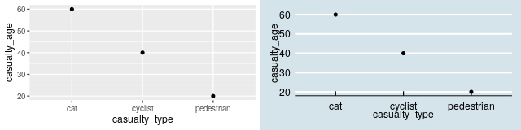

# R packages {#pkgs}

## What are packages?

R has over 15,000 packages published on the official 'CRAN' site and many more published on code sharing sites such as GitHub.
Packages are effectively plugins for R, that extend it in many ways.
Packages are useful because they enhance the range of things you can do with R, providing additional functions, data and documentation that build on the core (or technically 'base') R packages.
They range from general-purpose packages such as `tidyverse` and `sf` to domain-specific packages such as `stats19`.

This chapter demonstrates the package lifecycle with reference `stats19` and provides a taster of R's visualisation capabilities with reference to the general purpose package `ggplot2`.
The `stats19` package is particularly relevant for reproducible road safety research: its purpose is to download and clean road traffic casualty data from the UK's Department for Transport.
Domain-specific packages such as `stats19` are often written by subject-matter experts, providing tried and tested solutions in a particular specialism.

Regardless of which packages you install and use, they all go through the following main stages:^[
If for whatever reason you want to uninstall a package you can uninstall it in a fifth stage with commands such as `remove.packages("stats19")`.
]

1. installing it
2. loading it
3. using it
4. updating it

Of these, the third stage takes by far the most amount of time.
Stages 1, 2 and 4 are equally important, however: you cannot properly use a package unless it has been properly installed, loaded and, to get the best performance out of the latest version, updated when new versions are released.
We will learn each of these stages of the package lifecycle with the `stats19` package.

## The stats19 R package

Like many packages, `stats19` was developed to meet a real world need.
STATS19 data is provided as a free and open resource by the Department for Transport, encouraging evidence-based and accountable road safety research and policy interventions.
However, researchers at the University of Leeds found that repeatedly downloading and formatting open STATS19 data was time-consuming, taking valuable resources away from more valuable (and fun) aspects of the research process.
Importantly, manually recoding the data, from `1` to `Fatal` for example, was error-prone.
By packaging-up code to reliably solve the problem for ourselves, we found that we could solve the problem in a free, open and reproducible way for everyone [@lovelace_stats19_2019].

By abstracting the process to its fundamental steps (download, read, format), the package makes it easy to get the data into appropriate formats (of classes `tbl`, `data.frame` and `sf`), ready for for further processing and analysis steps.
The package built on previous work [@lovelace_who_2016] with several important improvements, including the conversion of crash data into geographic data into `sf` data frame for geographic research [e.g. @austin_use_1997].
A useful feature of the package is that it enables creation of geographic representations of the data, geo-referenced to the correct coordinate reference system, in a single function, called `format_sf()`.
Part funded by the RAC Foundation, the package should be of use to academic researchers and professional road safety data analysts working at local authority and national levels in the UK.

We will learn how to install, load and use the package in the next section, know-how that can be used to install and use any package.

## Installing packages

The `stats19` package is available on CRAN.
This means that it has a webpage on the CRAN website at [cran.r-project.org](https://cran.r-project.org).
The page at [cran.r-project.org/package=stats19](https://cran.r-project.org/package=stats19) provides useful information about the package, including who developed it, what the latest version is and when it was last updated.
More importantly, being 'on CRAN' (which technically means 'available on the [Comprehensive R Archive Network](https://cran.r-project.org/)') means that that it can be installed with the command `install.packages()` as follows:^[
To install the development version, which may have new features or but fixes that are not yet on CRAN, you can use the function`remotes::install_github("org/pkg")`.
The `stats19` package is hosted on the rOpenSci organisation at [github.com/ropensci/stats19](https://github.com/ropensci/stats19), so you can install the development version with `remotes::install_github("ropensci/stats19")` (you must have the `remotes` package installed before that will work).
Note: it's usually safest to stick with the latest version on CRAN unless you know what you're doing.
]

```{r, eval=FALSE}
install.packages("stats19")
```

Update packages with the command `update.package()` or in Tools > Check for Package Updates in RStudio.
You only need to install a package once.
<!-- **Note: avoid `install.packages()` within a script** -->
<!-- Packages only need to be installed once. -->
<!-- You can use `remotes::install_cran()` or `remotes::install_github()` to only install a package if it is not yet installed and up-to-date (note: you only need to use one of these): -->

```{r, eval=FALSE}
install.packages("sf")
# remotes::install_github("r-spatial/sf")
```

<!-- now talk about loading packages -->
Installed packages are loaded with the command `library()`.
Usually, the package will load silently.
In some cases the package will provide a message, as illustrated below.

```{r}
library(sf)
```

To use a function in a package without first loading the package, use double colons, as shown below (this calls the `tibble()` function from the `tibble` package).

```{r tibble2, eval=FALSE}
crashes_tibble = tibble::tibble(
  vehicle_type,
  casualty_type,
  casualty_age,
  dark
)
```

1. Take a look in the Packages tab in the Files pane in RStudio (bottom right by default).
1. What version of the `stats19` package is installed on your computer?
1. Run the command `update.packages()`. What happens? Why?

## ggplot2

Let's take a look at a particular package.
`ggplot2` is a generic plotting package that is part of the ['tidyverse'](https://www.tidyverse.org/) meta-package, which is an "opinionated collection of R packages designed for data science". 
All packages in the tidyverse "share an underlying design philosophy, grammar, and data structures". 
`ggplot2` is flexible, popular, and has dozens of add-on packages which build on it, such as `gganimate`.
To plot non-spatial data, it works as follows (see figure below, left for result):

```{r, message=FALSE, out.width="40%", eval=FALSE}
library(ggplot2)
ggplot(crashes) + geom_point(aes(x = casualty_type, y = casualty_age))
```

Note that the `+` operator adds layers onto one another.

1. Install a package that build on `ggplot2` that begins with with `gg`. Hint: enter `install.packages(gg)` and hit Tab when your cursor is between the `g` and the `)`.
1. Open a help page in the newly installed package with the `?package_name::function()` syntax.
1. Attach the package.
1. **Bonus:** try using functionality from the new 'gg' package building on the example above to create plots like those shown below (hint: the right plot below uses the economist theme from the `ggthemes` package, try other themes).

```{r gg-extend, echo=FALSE, message=FALSE, eval=FALSE}
library(ggplot2)
# install.packages("ggthemes")
g1 = ggplot(crashes) + geom_point(aes(x = casualty_type, y = casualty_age)) 
g2 = ggplot(crashes) + geom_point(aes(x = casualty_type, y = casualty_age)) +
  ggthemes::theme_economist()
g3 = cowplot::plot_grid(g1, g2)
ggsave(filename = "figures/ggtheme-plot.png", width = 8, height = 2, dpi = 80)
```

```{r gg2, echo=FALSE, out.width="80%", fig.align="center"}
library(ggplot2)

```

## dplyr

Another useful package in the tidyverse is `dplyr`.
It provides functions for manipulating data frames and using the pipe operator ` %>% `. 
The pipe puts the output of one command into the first argument of the next, as shown below (note the results are the same):

```{r}
library(dplyr)
class(crashes)       
crashes %>% class()
```

We will learn more about this package and its other functions in Chapter \@ref(data).
